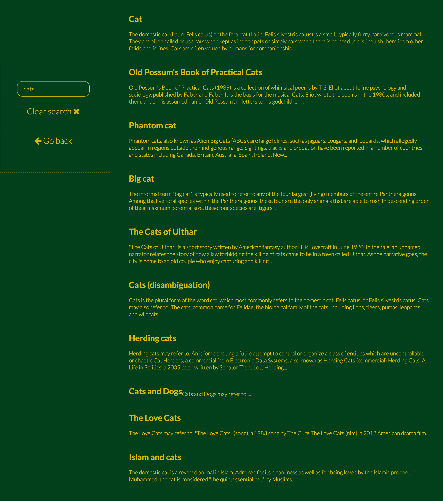

# Wikipedia search and view app

## [Preview the app here](https://emimnemonic.github.io/Wiki-Viewer/)

This is what it looks like on desktop:

And here's the search results view:

Built for [FCC's front-end project](https://www.freecodecamp.com/challenges/build-a-wikipedia-viewer).The following are the user stories to be fulfilled:

* I can search Wikipedia entries in a search box and see the resulting Wikipedia entries.
* I can click a button to see a random Wikipedia entry.

I used Wikipedia's API -doh :) and jQuery ajax method. I would've done it with AngularJS but it's a pretty small app. Also, I needed to get in touch with jQuery once again. 

It wasn't required but I made it fully responsive using Flexbox.

Colors inspired by Wes Anderson's Castello Cavalcanti.

Feel free to fork, comment, provide advice on how I could improve.